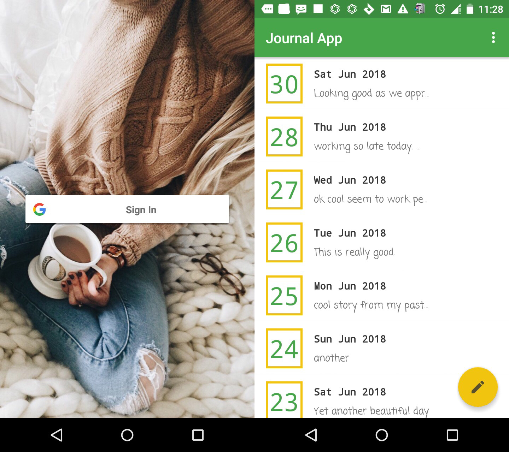

# JournalApp
A Simple android app that lets users enter their thoughts and feelings daily.
- Users are required to login using their google account (firebase Authentication is used)
- Users enter their daily thoughts and feelings which is save in a local DB (Room is used to implement this)
- Users swipe to delete and entire entries for that particular day is deleted after they confirm to delete
- Users select a date from a date picker, current date is selected by default when making a new entry
- Entries for a date that already contains records would be merged under same date
- Users can edit posts for the entire day from a single screen

# Screens


## Getting Started
Get started by downloading the zip of these repository or simply clone it to your PC
### Prerequisites
You must have installed 
- JDK (Java development Kit)
- Android Studio
### Installing
- Download and extract zip or clone
- Open project using android studio by selecting 
  ```
  import project
  ```
- Build and run project from android studio

### APK File
https://drive.google.com/file/d/1Sar_I012cCLZS6KAi5j9ARmSALn2kk8y/view?usp=sharing
  
## Built With
* [Maven](https://maven.apache.org/) - Dependency Management

## Authors
* **Eloka Udoji**

## License
This project is licensed under the MIT License - see the [LICENSE.md](LICENSE.md) file for details

## Acknowledgments

* Thanks to the Google, Udacity and Andela team for contributing so much to my learning of android development platform
* Special thanks to my friends in the ALC (andela learning communit) you guys are awwsome, couldn't have done it without you guys
* Thanks to my ALC Mentor Debo Ajagbe for all your guidiance, assistance and encouragement am happy to have been in your group
